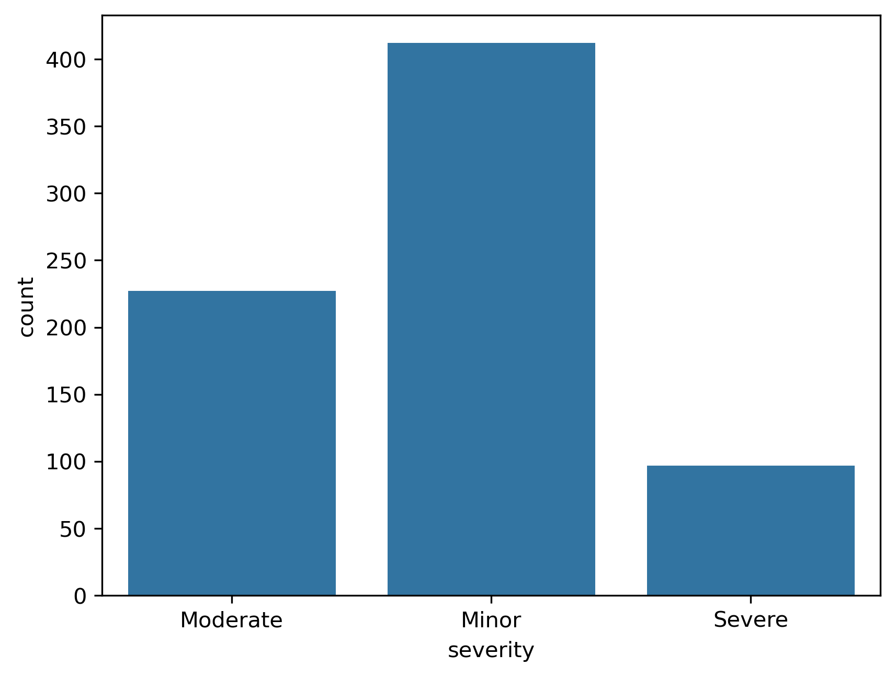
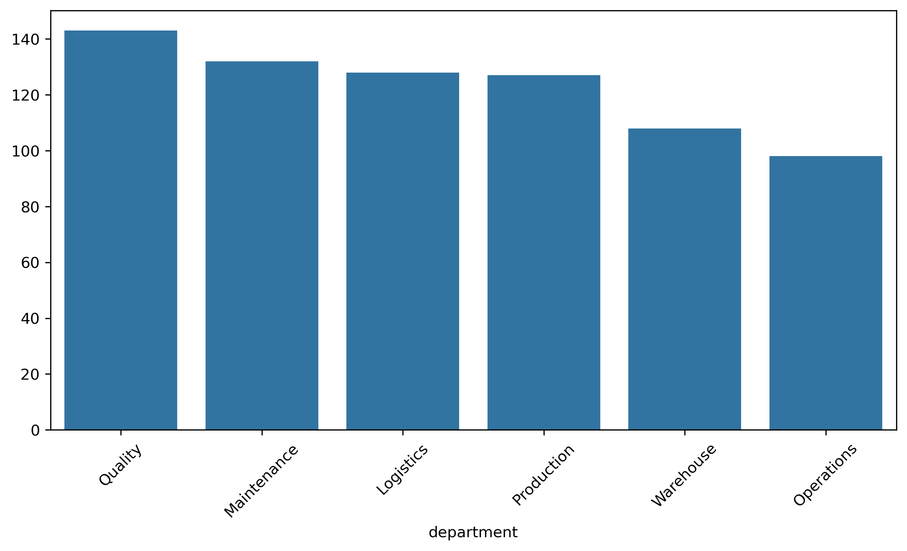
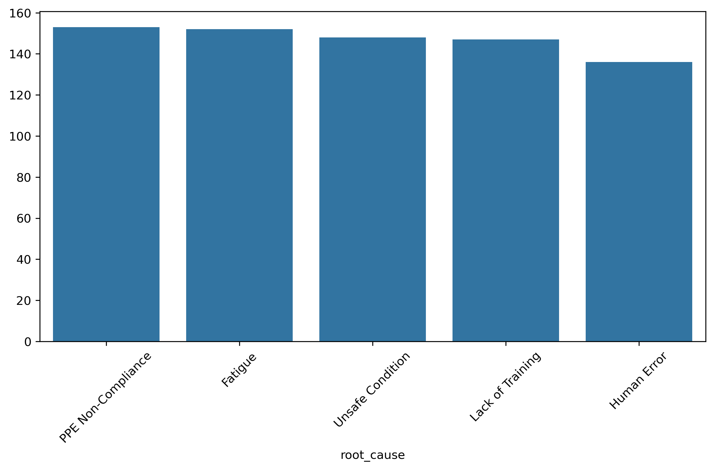
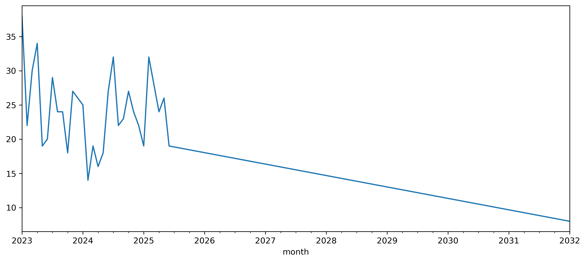
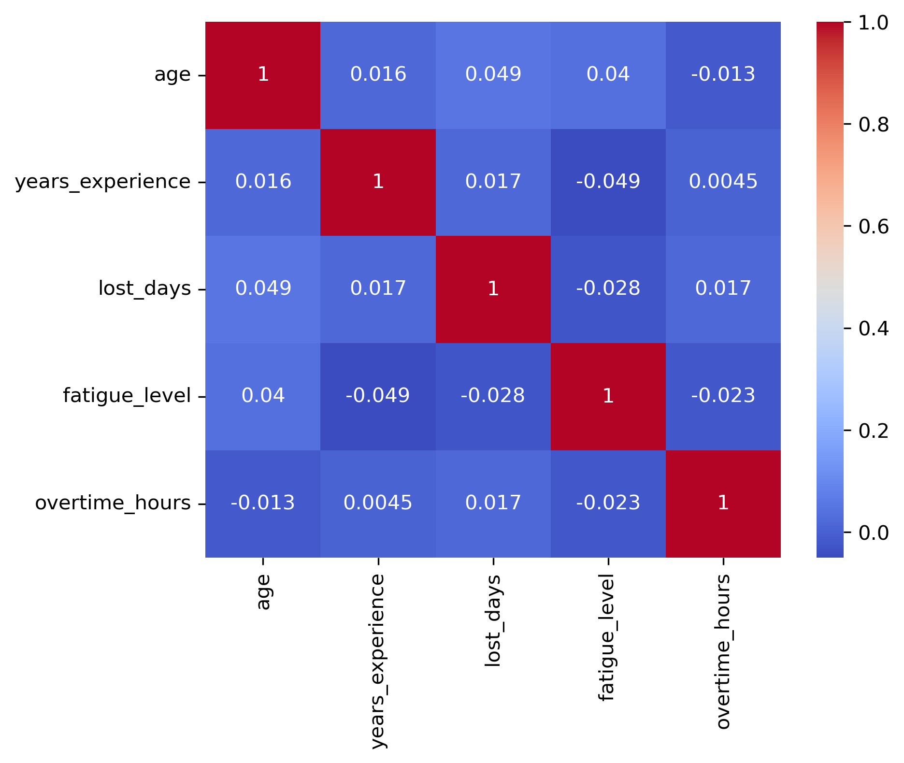

# Análisis de Datos en Seguridad y Salud en el Trabajo (SST)

## Descripción del Proyecto

Este proyecto simula un escenario real de análisis de datos aplicado a Seguridad y Salud en el Trabajo (SST).

El objetivo fue desarrollar un flujo completo de trabajo de analítica de datos, desde la identificación de problemas de calidad de datos hasta la generación de hallazgos y recomendaciones para la toma de decisiones.

A través de este proyecto se aplicaron técnicas de:

- Limpieza y preparación de datos
- Análisis Exploratorio de Datos (EDA)
- Visualización de información
- Generación de indicadores clave (KPIs)
- Interpretación de resultados
- Storytelling con datos

---

## Contexto del Negocio

Las organizaciones requieren información confiable para identificar patrones de accidentalidad, comprender factores de riesgo y diseñar estrategias efectivas de prevención.

Sin embargo, los datos suelen presentar problemas de calidad que afectan la precisión de los análisis y la toma de decisiones.

Este proyecto busca demostrar cómo transformar datos operativos en información útil para la gestión estratégica de SST.

---

## Objetivos

### Objetivo General

Analizar registros de accidentalidad laboral para identificar tendencias, factores asociados al riesgo y oportunidades de mejora en la gestión de Seguridad y Salud en el Trabajo.

### Objetivos Específicos

- Detectar y corregir problemas de calidad de datos.
- Construir un conjunto de datos confiable para el análisis.
- Identificar patrones de accidentalidad.
- Analizar la distribución de la severidad de los accidentes.
- Evaluar posibles relaciones entre fatiga, horas extras y días perdidos.
- Generar recomendaciones basadas en evidencia.

---

## Dataset

El conjunto de datos contiene información relacionada con:

- Características demográficas de los trabajadores.
- Área o departamento.
- Cargo desempeñado.
- Tipo de accidente.
- Nivel de severidad.
- Días perdidos.
- Uso de EPP.
- Capacitación en SST.
- Nivel de fatiga.
- Horas extras.
- Causa raíz del evento.

### Resumen del Dataset

| Indicador | Valor |
|------------|---------|
| Registros analizados | 721 |
| Variables | 17 |
| Días perdidos acumulados | 5.794 |
| Promedio de días perdidos | 8,04 |

---

## Estructura del Proyecto

```text
SST/
│
├── data/
│   ├── raw/
│   └── cleaned/
│
├── images/
│
├── notebooks/
│   ├── 01_data_cleaning.ipynb
│   └── 02_exploratory_analysis.ipynb
│
├── reports/
│
├── README.md
├── requirements.txt
└── .gitignore
```

---

## Tecnologías Utilizadas

- Python
- Pandas
- NumPy
- Matplotlib
- Seaborn
- Jupyter Notebook
- Git
- GitHub

---

## Proceso de Limpieza de Datos

El dataset original incluía problemas de calidad simulados para recrear escenarios comunes en proyectos reales:

- Valores faltantes
- Registros duplicados
- Formatos inconsistentes
- Errores tipográficos
- Categorías inválidas
- Valores atípicos

Durante el proceso de limpieza se realizaron actividades de:

- Estandarización de categorías
- Tratamiento de valores nulos
- Eliminación de duplicados
- Corrección de tipos de datos
- Validación de consistencia

---

## Indicadores Clave (KPIs)

| Indicador | Resultado |
|------------|------------|
| Total de accidentes | 721 |
| Días perdidos acumulados | 5.794 |
| Promedio de días perdidos | 8,04 |
| Accidentes menores | 403 |
| Accidentes moderados | 223 |
| Accidentes severos | 95 |

---

## Visualizaciones

### Distribución de Severidad



### Accidentes por Departamento



### Causas Raíz



### Tendencia Mensual de Accidentes



### Análisis de Correlación



---

## Principales Hallazgos

- La mayoría de los accidentes fueron clasificados como leves.
- La fatiga se identificó como la principal causa raíz de los eventos.
- Los departamentos de Calidad, Mantenimiento, Producción y Logística concentraron la mayor cantidad de accidentes.
- Los días perdidos representan un impacto importante sobre la productividad.
- Se observó una relación positiva entre fatiga, horas extras y consecuencias de los accidentes.

---

## Conclusión Ejecutiva

El análisis evidencia que la fatiga constituye uno de los factores de riesgo más relevantes dentro de la organización.

Los resultados sugieren que la gestión de cargas de trabajo y el control de horas extras deben convertirse en prioridades estratégicas para reducir la ocurrencia de accidentes y minimizar los días perdidos.

Asimismo, los departamentos con mayor concentración de eventos requieren intervenciones focalizadas que permitan fortalecer la cultura de seguridad y mejorar los controles operacionales.

La analítica de datos aplicada a SST permite transformar registros operativos en información útil para la toma de decisiones preventivas y la mejora continua.

---

## Recomendaciones

- Fortalecer programas de gestión de fatiga.
- Monitorear la exposición a jornadas prolongadas.
- Incrementar la frecuencia de capacitaciones.
- Reforzar el cumplimiento del uso de EPP.
- Priorizar intervenciones en áreas críticas.
- Implementar indicadores predictivos de seguridad.

---

## Habilidades Demostradas

### Análisis de Datos

- Limpieza de datos
- Transformación de datos
- Análisis exploratorio (EDA)
- Visualización de datos
- Interpretación de resultados

### Herramientas Técnicas

- Python
- Pandas
- NumPy
- Matplotlib
- Seaborn
- Git
- GitHub

### Conocimiento de Negocio

- Seguridad y Salud en el Trabajo (SST)
- Investigación de accidentes
- Gestión del riesgo
- Indicadores de seguridad

---

## Sobre la Autora

**Victoria Diago Orozco**

Ingeniera industrial con competencias en Analítica de Datos para apoyar la toma de decisiones basada en evidencia y la gestión estratégica del riesgo.